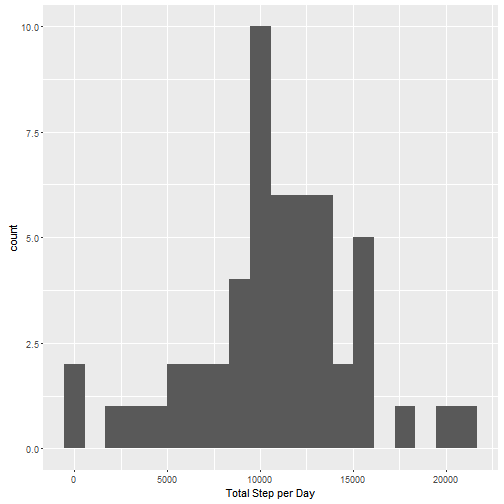
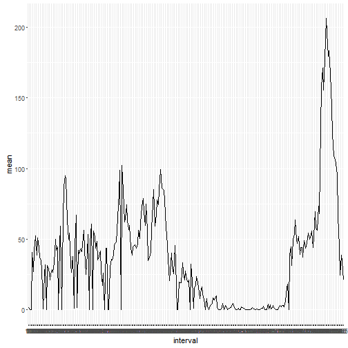
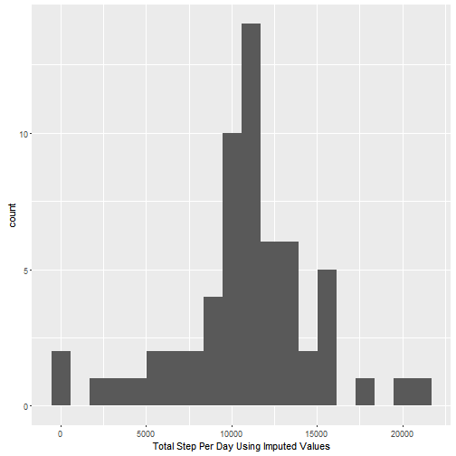
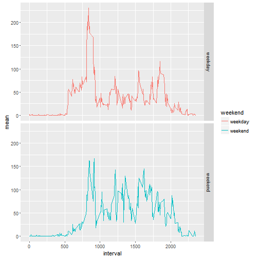

## my first Knitr work


```r
library(ggplot2)
activity<-read.csv(file="C:/Users/Yao/Documents/activity.csv")
```

## What is mean total number of steps taken per day?


```r
daytotalstep<-tapply(activity$steps,activity$date,sum)#按天加总数据量
daytotalstep<-data.frame(names(daytotalstep),daytotalstep)#数组转换成数据框
names(daytotalstep)<-c("name","total")#数据框变量命名
qplot(total,data=daytotalstep,geom="histogram",xlab="Total Step per Day",bins=20)#作直方图
```

```
## Warning: Removed 8 rows containing non-finite values (stat_bin).
```



```r
print("Mean")
```

```
## [1] "Mean"
```

```r
mean(daytotalstep$total,na.rm=TRUE)#获取均值
```

```
## [1] 10766.19
```

```r
print("Median")
```

```
## [1] "Median"
```

```r
median(daytotalstep$total,na.rm=TRUE)#获取中位数
```

```
## [1] 10765
```

## What is the average daily activity pattern?


```r
meanstep<-tapply(activity$steps,activity$interval,mean,na.rm=TRUE)#按时间点加总
meanstep<-data.frame(names(meanstep),meanstep)#数组转换成数据框
names(meanstep)<-c("interval","mean")#数据框变量命名
qplot(interval,mean,data=meanstep,geom="line",group=1)#作折线图
```



```r
zuida<-max(meanstep$mean)#找出每天最大运动量的时间点
print("the Max Step of Interval")
```

```
## [1] "the Max Step of Interval"
```

```r
subset(meanstep,mean==zuida)#提取时间点
```

```
##     interval     mean
## 835      835 206.1698
```

## Imputing missing values


```r
nomissing<-activity
interval<-meanstep$interval
sum(is.na(activity))#获取缺失值总数
```

```
## [1] 2304
```

```r
for(i in 1:length(nomissing[,1]))#缺失值插补，均值，用interval
        {if(is.na(nomissing[i,1])){
                nomissing[i,1]<-meanstep[which(interval==nomissing[i,3]),2]
        }
        else if (is.na(nomissing[i,1])==FALSE)
      {nomissing[i,1]<-nomissing[i,1]}
        }
daytotalstep1<-tapply(nomissing$steps,nomissing$date,sum)#插补后的数据，做每天运动总量的直方图
daytotalstep1<-data.frame(names(daytotalstep1),daytotalstep1)
names(daytotalstep1)<-c("name","total")
qplot(total,data=daytotalstep1,geom="histogram",xlab="Total Step Per Day Using Imputed Values",bins=20)
```



```r
print("Old Mean")
```

```
## [1] "Old Mean"
```

```r
mean(daytotalstep$total,na.rm=TRUE)#获取均值
```

```
## [1] 10766.19
```

```r
print("Old Median")
```

```
## [1] "Old Median"
```

```r
median(daytotalstep$total,na.rm=TRUE)#获取中位数
```

```
## [1] 10765
```

```r
print("New Mean")
```

```
## [1] "New Mean"
```

```r
mean(daytotalstep1$total,na.rm=TRUE)
```

```
## [1] 10766.19
```

```r
Print("New Median")
```

```
## Error in eval(expr, envir, enclos): 没有"Print"这个函数
```

```r
median(daytotalstep1$total,na.rm=TRUE)
```

```
## [1] 10766.19
```

## Are there differences in activity patterns between weekdays and weekends?


```r
nomissing$date<-as.Date(nomissing$date)#转换日期格式，方能被weekdays()函数读取
for (i in 1:length(nomissing[, 2])){ #建立新的变量区分工作日和周末
    if (weekdays(nomissing[i, 2])=="星期六")
        {nomissing$weekend[i]<-'weekend'}
    else if ((weekdays(nomissing[i, 2])=="星期日"))
        {nomissing$weekend[i]<-'weekend'}
    else {nomissing$weekend[i]<-'weekday'}
}
weekday<-aggregate(nomissing$steps, nomissing[,c("interval","weekend")],mean)#按时间点和是否周末计算均值
names(weekday)[3]<-"mean"
ggplot(data=weekday, aes(x=interval, y=mean, color=weekend))+geom_line() + facet_grid(weekend~.)#作图
```


